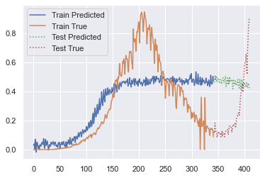

# ML Major Project

## Logs

### 18th April 2021
#### Sharad
- Basic Model Exploration. End to end pipeline for the simplest model
- Basic Model considers:
  - Usual features
  - Mobility Data (Overall; Separated based on errand type)
- Basic Model fails:
  - LSTM
  - Basic Model suffers from distribution shift. In particular, it is not accounting for features in the future period. 
  - The final model just seems to predict somewhat of an average of the features as shown below

</img>

- Thoughts
  - It seems critical that we need a model that is in some sense "evolving"
  - For region based modelling, perform ablation into individual features. And also, into region based plotting 

### 19th April 2021
#### Vybhav
- Transfer Learning
  - Tested the basic model (lagged mobility + testing data) on UK data as they've already had their second peak
  - No real improvement seen in results

- Basic Model : Linear Regression
  - Features considered : 7 day lagged mobility, daily tests, daily deaths
  - Seems to do better than LSTM, though still pretty poor

#### Devanshu
- Regional Mobility Analysis
  -  Most of the regional mobility trends are really great indicators of the future cases counts, a few examples for reference
  -  These are just the Grocery and Pharmacy change, and for a few states but it gives a flavour
  - 
  - 
  - 

#### Sharad
- Created Regional Mobility Aggregator Notebooks and DataFrames
